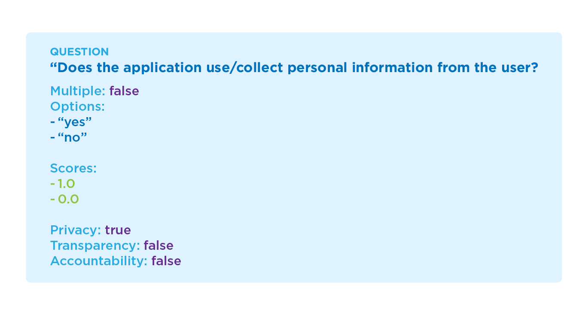

# AIAs evaluation questions

The questions of our AIAs identify the system's compliance with at least three ethical principles identified by one of our previous studies ([WAIE](https://nkluge-correa.github.io/worldwide_AI-ethics/)). Hence, each AIA generates impact scores relative to these assessed principles.

<p align="center">
  
</p>

Ultimately, these assessments generate a standardized impact level on each ethical principle evaluated by each AIA. i.e., we divide the attained score by the maximum attainable score for each principle. At the same time, the overall cumulative impact of all assessed principles represents the general impact of a system against a specific AIA. For example:

$$\text{Impact Score}\_{\text{ privacy}} = \frac{\text{Score}}{\text{Max Score}}$$

$$\text{AIA Score} = \frac{\text{Impact Score}\_{\text{ privacy}} + \text{Impact Score}\_{\text{ transparency}} + \text{Impact Score}\_{\text{ accountability}}}{\text{Nº  of evaluated principles}}$$

In the following folders ([anti-discrimination](./anti-discrimination), [consumer-rights](./consumer-rights), [privacy-and-data-protection](./privacy-and-data-protection), and [protection-children](./protection-children)), you will find all questions for each AIA, presented as YAML files, as shown in the figure above. These specification files are structured as shown below:

```yaml
question: "The question you wish to implement."
multiple: false # If is not multiple choice, else, `true`.
options: 
  - Option 1
  - Option 2
  - Option 3
scores: # The number of options and respective scores should match, and be in the same order.
  - 1.0
  - 2.0
  - 3.0
principle1: true # If this question evaluates this principle, else, `false`.
principle2: true
principle3: true
information: "An informative that may help the user understand the question." # If no information is to be given, set the value to `null`.
```

You can create as many questions as you want. Remember that this demo will display them in ascending order, using their number as a sorting key.
