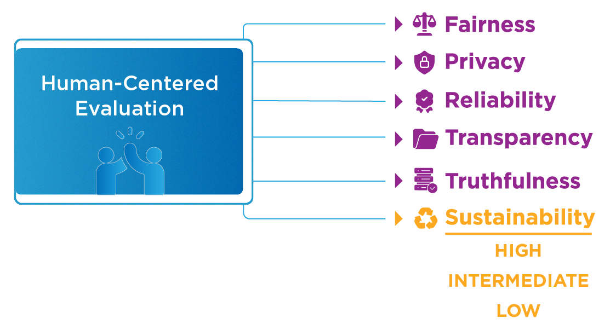
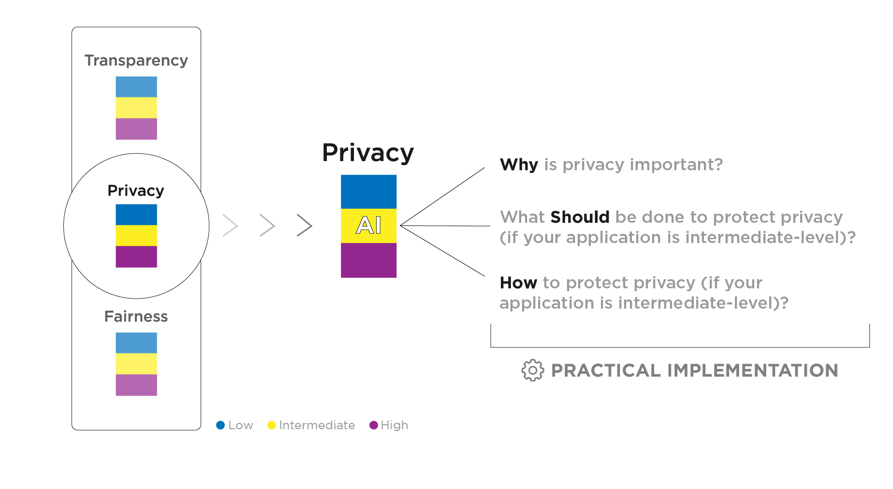

# Ethical Framing and the WHY-SHOULD-HOW method

This folder contains all principles available for ethical framing ([fairness](./fairness), [privacy](./privacy), [reliability](./reliability), [sustainability](./sustainability), [transparency](./transparency), [truthfulness](./truthfulness)). After the evaluation stage, the EPS framework requires that human evaluators classify the system under consideration in an impact matrix. The matrix comprises three recommendation levels tailored to each impact level - **high**, **intermediate**, and **low**.

    

Hence, each principle has three distinct possible recommendations tailored to specific impact levels, e.g., [Sustainability-low](./sustainability/SHOULD-HOW-LOW.md), [Sustainability-intermediate](./sustainability/SHOULD-HOW-INTERMEDIATE.md), and [Sustainability-high](./sustainability/SHOULD-HOW-HIGH.md).

    

Each principle folder contains the corresponding set of tailored recommendations. These recommendations come in a WHY-SHOULD-HOW format.

The WHY-SHOULD-HOW methodology is the format in which the evaluation outcome is presented. The WHY step is structured to demonstrate the relevancy of each principle, providing the conceptualization and highlighting paradigmatic cases of deficit implementation in a structure that answers the questions "_What is said principle?_" and "_Why should you care about it?_". The SHOULD and HOW are attached to streamline the normative guidance and the practical tools to address it.

    

In each folder, the user can find a human-readable version of our recommendations as markdown files, while the HTML files are used to render our demo.
