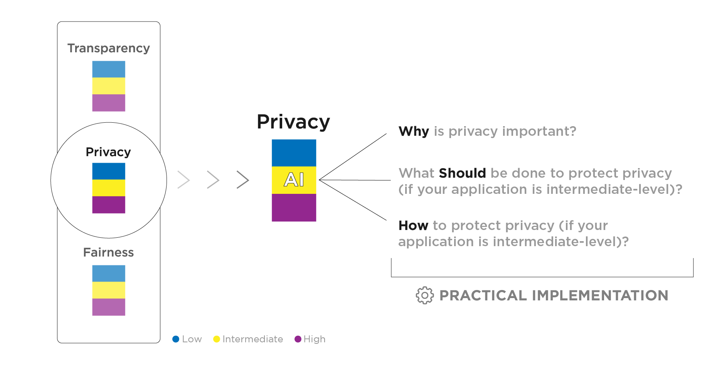

# Reliability

This folder contains a set of tailored recommendations for improvements in AI Reliability. These recommendations come in a WHY-SHOULD-HOW format.

The WHY-SHOULD-HOW methodology is the format in which the evaluation outcome is presented. The WHY step is structured to demonstrate the relevancy of each principle, providing the conceptualization and highlighting paradigmatic cases of deficit implementation in a structure that answers the questions "_What is said principle?_" and "_Why should you care about it?_". The SHOULD and HOW are attached to streamline the normative guidance and the practical tools to address it.

    

The user can find a human-readable version of our recommendations as markdown files, while the HTML files are used to render our demo.
