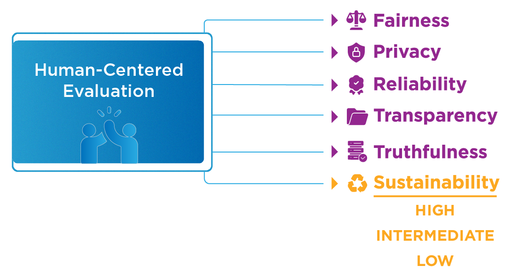

<div align="center">

# Crossing the principle–practice gap in AI ethics with ethical problem-solving

[Demo](https://eps-demo.abstra.app/Home) | [Paper](https://link.springer.com/article/10.1007/s43681-024-00469-8)

</div>

Ethical Problem Solving (EPS) is a framework to promote the development of safe and ethical artificial intelligence. EPS is divided into an evaluation stage (performed via **Algorithmic Impact Assessment** tools) and a recommendation stage (the **WHY-SHOULD-HOW** method). Both these stages represent distinct steps in a human-centered _EaaS_ (**Ethics as a Service**) framework developed by _Nicholas Kluge Corrêa_, _James William Santos_, _Camila Galvão_, _Marcelo Pasetti_, _Dieine Schiavon_, _Faizah Naqvi_, _Robayet Hossain_, and _Nythamar de Oliveira_.

This repository contains a simple demo of our framework, **and it should not be considered a working EaaS platform. The full implementation of our method as an EaaS is currently under development.**

<p align="center">
    
</p>

The following steps can summarize the flow of the EPS methodology:

## Pre-AIA

The flow of the ethical problem-solving framework begins with a pre-algorithmic impact assessment (Pre-AIA). The pre-assessment gauges preemptively the realm of impact of a particular system, leading to the actual tools of impact assessment. This preliminary assessment informs the user what algorithmic impact assessment surveys (AIAs) are required to fulfill the evaluation stage. For example, the user must perform the privacy and data protection AIA if the intended application utilizes personally identifiable information.

<p align="center">
    
</p>

After this brief assessment, the user is directed to the next stage.

## Evaluation Stage

Our evaluation stage consists of questionnaires with pre-defined questions and answers that can be single-choice or multiple-choice. Our current implementation of these AIAs covers the following themes: **data protection and privacy**, **protection of children and adolescents**, **antidiscrimination**, and **consumer rights**. These AIAs use legally binding standards to deduce the implications of AI systems through an objective lens.

<p align="center">
    
</p>

The questions of our AIAs identify the system's compliance with at least three ethical principles identified by one of our previous studies ([WAIE](https://nkluge-correa.github.io/worldwide_AI-ethics/)). Hence, each AIA generates impact scores relative to these assessed principles.

<p align="center">
    
</p>

Ultimately, these assessments generate a standardized impact level on each ethical principle evaluated by each AIA. i.e., we divide the attained score by the maximum attainable score for each principle. At the same time, the overall cumulative impact of all assessed principles represents the general impact of a system against a specific AIA. For example:

$$\text{Impact Score}\_{\text{ privacy}} = \frac{\text{Score}}{\text{Max Score}}$$

$$\text{AIA Score} = \frac{\text{Impact Score}\_{\text{ privacy}} + \text{Impact Score}\_{\text{ transparency}} + \text{Impact Score}\_{\text{ accountability}}}{\text{Nº of evaluated principles}}$$

Our AIAs provide an impact score that cannot address all of the ubiquities attached to the ethical issues that AI systems present. Hence, in our current implementation of the EPS framework, we developed a more qualitative survey to accompany the evaluation stage, entitled Ethical Troubleshoot, aimed at going beyond an objective evaluation. In short, this troubleshooting query allows the respondent to divulge how a given AI system or application has been developed in a human-centric way. It utilizes a combination of multiple-choice, single-choice, and open-ended questions to gauge the system's scope, its intended and unintended uses, and its target audience.

## Ethical Framing

After the evaluation stage, the EPS framework requires that human evaluators classify the system under consideration in an impact matrix. The matrix is constituted by three levels of recommendation tailored to each impact level - **high**, **intermediate**, and **low** - and six different ethical principles gathered from the [WAIE](https://nkluge-correa.github.io/worldwide_AI-ethics/) review, i.e., fairness, privacy, transparency, reliability, truthfulness, and sustainability.

<p align="center">
    
</p>

Hence, each principle has three distinct possible recommendations tailored to specific impact levels, e.g., Sustainability-low, Sustainability-intermediate, and Sustainability-high.

<p align="center">
    
</p>

## Recommendation stage (WHY-SHOULD-HOW)

The WHY-SHOULD-HOW methodology is the format in which the evaluation outcome is presented.

The WHY step is structured to demonstrate the relevancy of each principle, providing the conceptualization and highlighting paradigmatic cases of deficit implementation in a structure that answers the questions "_What is said principle?_" and "_Why should you care about it?_". The SHOULD and HOW are attached to streamline the normative guidance and the practical tools to address it.

The SHOULD provides the metric utilized to gauge the level of recommendation regarding the corresponding principle, the level of recommendations indicated for the specific case, and the set of recommendations in a summarized form. Finally, the HOW component offers the practical tools and strategies required to implement the recommendations made in the SHOULD stage.

<p align="center">
    
</p>

## Tools

The HOW step of the WHY-SHOULD-HOW methodology pragmatizes the normative recommendations of our method. Hence, throughout the HOW stage, in every principle evaluated, the developer is presented with ready-to-use tools paired with demonstrations in the form of an [open repository of tutorials](https://github.com/Nkluge-correa/TeenyTinyCastle). The repository has many examples of tools and techniques developed to deal with the potential issues of an AI application (e.g., algorithmic discrimination, model opacity, brittleness, etc.), all being worked through with some of the most common contemporary AI applications (e.g., computer vision, natural language processing, forecasting, etc.)

<p align="center">
    
</p>

By following the EPS framework, evaluators and developers working together can identify ethical concerns and take proactive steps to address them. This ultimately leads to tightening the principle-practice gap, i.e., _from AI to beneficial AI_.

## How to run?

The demo is powered by the [`abstra`](https://www.abstra.io/) library, which runs a [`flask`](https://flask.palletsprojects.com/en/3.0.x/) app under the hood. To run the app locally:

1. Clone this repository

```bash
git clone https://github.com/Nkluge-correa/ethical-problem-solving.git
```

2. Install the requirements

```bash
pip install -r requirements.txt
```

3. Lunch the `abstra` app.

``` bash
abstra serve
```

This demo is hosted in the [Abstra Cloud](https://eps-demo.abstra.app/Home).

## How is this repository structured?

The main folder in this repo contains the following:

1. The [`Home.py`](Home.py) file is simply an HTML version of this README file. It only serves as the "cover" of our demo, explaining the EPS methodology. The [`abstra.json`](abstra.json) file serves to order and structure the paths of the files for constructing the abstra page and the sidebar in our demo. **If the name or path of any files in this repo is changed, the respective path in the [`abstra.json`](abstra.json) file should also be changed.**

2. The scripts for all the **AIAs** ([`AIA-anti-discrimination.py`](AIA-anti-discrimination.py), [`AIA-consumer-rights.py`](AIA-consumer-rights.py), [`AIA-privacy-and-data-protection.py`](AIA-privacy-and-data-protection.py), and [`AIA-protection-children.py`](AIA-protection-children.py)), the **Pre-AIA survey** ([`AIA-pre-survey.py`](AIA-pre-survey.py)), and the **Ethical Troubleshoot** (`Ethical-troubleshoot.py`) assessment. The scripts for the AIAs have the implementation of the score calculation in it. Meanwhile, the Pre-AIA survey merely prescribes what assessments should be performed. Lastly, the Ethical Troubleshoot script collects all the user answers and saves them as a CSV file. In principle, all the information gathered in these surveys should be used to inform an ethics board. This board is then responsible for performing the ethical framing stage.

3. The scripts for all the recommendations tied to the EPS ([`EPS-fairness.py`](EPS-fairness.py), [`EPS-privacy.py`](EPS-privacy.py), [`EPS-reliability.py`](EPS-reliability.py), [`EPS-sustainability.py`](EPS-sustainability.py), [`EPS-transparency.py`](EPS-transparency.py), [`EPS-truthfulness.py`](EPS-truthfulness.py)). Each of these scripts allows the controller to choose a given level of risk (**low**, **intermediate**, and **high**), which then sends them to an informative set of HTML pages that follow the **WHY-SHOULD-HOW** method. In principle, the ethical framing aspect of the recommendation stage is meant to be done by an ethics board. Meanwhile, all subsequent **WHY-SHOULD-HOW** information is sent back to the user (i.e., developer of the system under evaluation), along with the scores related to the evaluation stage and a written report produced by the ethics board.

4. The [AIA folder](AIA/) contains four subfolders ([anti-discrimination](AIA/anti-discrimination), [consumer-rights](AIA/consumer-rights), [privacy-and-data-protection](AIA/privacy-and-data-protection), and [protection-children](AIA/protection-children)). Each of these subfolders contains the questions related to each respective AIA.

5. The [EPS folder](EPS/) contains six subfolders ([fairness](EPS/fairness), [privacy](EPS/privacy), [reliability](EPS/reliability), [sustainability](EPS/sustainability), [transparency](EPS/transparency), [truthfulness](EPS/truthfulness)). Each folder contains the **WHY-SHOULD-HOW** informative for their respective principles. Inside each of these subfolders, one can find a readable version and an HTML version. The HTML files are the ones rendered by the abstra app (to convert markdown to HTML, you can use the [`markdown-html-converter.py`](markdown-html-converter.py) utility script). While the WHY is the same for each level of impact, all the SHOULD-HOW files have their respective impact level as a suffix (e.g., SHOULD-HOW-INTERMEDIATE).

6. The [img folder](img/) contains the images used throughout this demo.

## Disclaimer

1. The tools and assessments in this demo are intended to be an academic display of our research.
2. The results obtained by our tools are not legal/technical advice. We suggest consulting a specialist in all cases.
3. Completing the tools indicates guidelines for mitigating algorithmic impacts and suggests measures to solve ethical problems. However, no warranties, express or implied, are made regarding the future performance of the application or the organization.
4. It is up to the stakeholders who have used the tools and assessments to seek to prevent, mitigate, and resolve the possible impacts identified.
5. The author's disclaimer responsibility and the results presented do not serve as a certificate or attestation for ethical practices.
6. The Algorithmic Impact Assessments (AIAs) are based on some legislative texts (Consumer Defense Code, Criminal Code, Statute of the Child and Adolescent, General Data Protection Law). However, they do not lend themselves to exhausting their content for legal compliance.
7. The information, opinions, estimates, and guidelines contained in the platform refer to the present date and may need to be updated due to the passage of time or possible changes.

## Cite as

```latex
@article{correa2024eps,
  doi = {10.1007/s43681-024-00469-8},
  url = {https://link.springer.com/article/10.1007/s43681-024-00469-8},
  author={Corr{\^e}a, Nicholas Kluge and Santos, James William and Galv{\~a}o, Camila and Pasetti, Marcelo and Schiavon, Dieine and Naqvi, Faizah and Hossain, Robayet and De Oliveira, Nythamar},
  title = {Crossing the principle–practice gap in AI ethics with ethical problem-solving},
  year = {2024},
  publisher = {Springer},
  journal = {AI and Ethics},
}
```

## Funding

This research was funded by RAIES ([Rede de Inteligência Artificial Ética e Segura](https://www.raies.org/)). RAIES is a project supported by FAPERGS ([Fundação de Amparo à Pesquisa do Estado do Rio Grande do Sul](https://fapergs.rs.gov.br/inicial)) and CNPq ([Conselho Nacional de Desenvolvimento Científico e Tecnológico](https://www.gov.br/cnpq/)).

<p align="center">
    <a href="https://www.raies.org" target="_blank">
        
    </a>
</p>

## License

Ethical Problem Solving © 2024 by Nicholas Kluge Corrêa, James William Santos, Camila Galvão, Marcelo Pasetti, Dieine Schiavon, Faizah Naqvi, Robayet Hossain, and Nythamar de Oliveira is licensed under [CC BY-SA 4.0](https://creativecommons.org/licenses/by-sa/4.0/).
